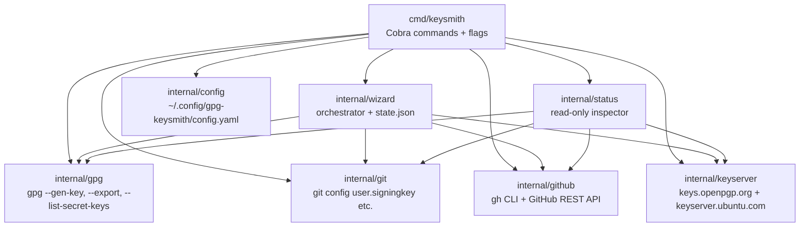

# Contributing to gpg-keysmith

gpg-keysmith is a Go CLI that automates the full path from "no GPG key" to
"signed commits flowing on GitHub" — key generation, export, git signing
config, GitHub public-key upload, repo secrets, and keyserver publication,
orchestrated by a single `keysmith wizard` command. Contributions are welcome:
bug reports, fixes, documentation improvements, and new features.

## Prerequisites

| Tool | Version | Why |
| --- | --- | --- |
| Go | 1.22+ | Build and test the CLI |
| `gpg` | any modern GnuPG | Runtime dep for key generation/export/detect |
| `git` | any modern git | Runtime dep for signing config and repo operations |
| `gh` | GitHub CLI 2.0+ | Runtime dep for the `github` step (repo secrets + PR) |
| `golangci-lint` | latest | CI lint gate (`make ci` step 3) |
| `upx` | any recent version | Optional — UPX-compresses release artifacts |

Install the runtime tools with your OS package manager (`apt`, `brew`, etc.).
`golangci-lint` and `upx` are optional for normal development — `make ci`
degrades gracefully when they are absent, and `make build` skips UPX when
`upx` is not installed or the target OS is macOS.

## Getting the source

```bash
git clone https://github.com/Korrnals/gpg-keysmith.git
cd gpg-keysmith
make build    # compiles keysmith into ./bin (UPX-compressed if upx is present)
make ci       # 7-step local CI gate — must be green before any PR
```

The build produces `./bin/keysmith`. Run it directly or add `./bin` to your
`PATH` for local testing.

## Development workflow

This project follows a **trunk-based** workflow: short-lived feature branches
off `main`, merged via squash-merge pull requests.

1. **Branch.** Create a branch from `main` using a descriptive kebab-case
   name with a type prefix:

   ```bash
   git checkout main
   git pull
   git checkout -b feat/support-ed25519   # new feature
   git checkout -b fix/publish-retry      # bug fix
   git checkout -b docs/man-page          # docs only
   ```

2. **Commit.** Use [Conventional Commits](https://www.conventionalcommits.org/)
   for commit messages. The scope is the affected package or command:

   ```text
   feat(gpg): support ed25519 key generation
   fix(publish): retry on transient HTTP 503
   docs(commands): document --passphrase-file behaviour
   refactor(wizard): extract step runner for testability
   test(github): cover repo-secrets happy path
   chore: bump go version to 1.22
   ```

   Group commits by **logical theme**, not by session or by file. A session
   that produced a feature + a bugfix + a docs polish becomes three commits,
   not one blob. Each commit should be a coherent theme a reviewer can
   reason about in isolation.

3. **Push and open a PR.** Push the branch, open a pull request on GitHub,
   and request review. Reference any issue the PR closes in the body
   (e.g. `Closes #42`).

4. **Squash-merge.** Maintainable history — one commit per merged PR.
   No direct commits to `main`; every change lands through a reviewed PR.

## Local CI

`make ci` runs a 7-step gate that mirrors what the maintainer checks before
merge. All steps must be green **by fix, never by suppression**:

| Step | What it does |
| --- | --- |
| 1 | `go mod verify` — dependencies match `go.sum` |
| 2 | `gofmt -l` — all Go files are formatted (scope: git-tracked `*.go`) |
| 3 | `golangci-lint run ./...` — 0 issues required |
| 4 | `go vet ./...` — static analysis |
| 5 | `go build ./...` — the whole module compiles |
| 6 | `go test -race ./...` — unit tests with the race detector |
| 7 | `go vet` on the `integration` build tag — tagged test files compile |

A **pre-commit hook** runs `make ci` automatically on every commit. Install
it once via `scripts/install-hooks.sh` (the hook file is gitignored — it
lives in `.git/hooks/` and is never committed):

```bash
scripts/install-hooks.sh
```

### Lint discipline

`golangci-lint` must report **0 issues**. When a finding fires:

1. Read the message and understand which rule fired.
2. Fix the underlying defect so the message goes away **because the problem
   is gone**, not because the alarm is muted.
3. Suppression (`//nolint:...`) is allowed **only** for a confirmed
   false-positive in the linter itself (not in your code), with a one-line
   comment naming the rule and the reason, scoped to a single line or
   function. Cosmetic dislike of a rule is not a valid reason.

This matches the project-wide lint-and-validate policy: a green run obtained
by suppression is not a green run.

## Testing

```bash
go test -race ./...                    # all unit tests, race detector on
go test -race ./internal/wizard/...    # one package
go test -tags=integration ./...        # integration tests only (need real gpg/git/gh)
```

### Unit test conventions

Unit tests must be **deterministic and hermetic**:

- **No real subprocess exec.** Mock the boundaries (gpg, git, gh, keyserver)
  via function-variable overrides. See `internal/wizard/wizard_test.go`
  (`stepRunners` table) and `cmd/keysmith/main_test.go` (hoisted `*Fn`
  package variables like `detectExistingKeysFn`) for the established pattern.
- **No real network.** Use `net/http/httptest` for HTTP-based packages
  (`internal/github`, `internal/keyserver`). See `internal/keyserver/publish_test.go`.
- **Temp dirs, not fixed paths.** Use `t.TempDir()` for any filesystem writes;
  never write to the user's real `~/.gnupg` or `~/.config`.
- **State cleanup.** In `cmd/keysmith/main_test.go`, `resetGlobalFlags(t)`
  is registered via `t.Cleanup` so one test does not leak package-level flag
  state into the next. Follow the same pattern when you touch global flags.

Integration tests are tagged `//go:build integration` and are excluded from
the default `go test ./...` run. They exercise real `gpg`/`git`/`gh` binaries
and are for the maintainer's local verification, not CI.

## Releasing

Only the **maintainer** cuts releases. Contributors do not need to do this.

The release process lives in `scripts/release.sh`. It bumps `VERSION`
(the single source of truth), updates `CHANGELOG.md`, builds UPX-compressed
artifacts, commits, tags, pushes, and creates a GitHub Release with the
artifacts attached:

```bash
scripts/release.sh patch      # 1.1.1 -> 1.1.2
scripts/release.sh minor      # 1.1.1 -> 1.2.0
scripts/release.sh major      # 1.1.1 -> 2.0.0
scripts/release.sh --no-upload  # bump locally without pushing the release
```

The script gates on `scripts/ci.sh` (the same 7 steps as `make ci`) — a red
CI blocks the release. `CHANGELOG.md` follows the
[Keep a Changelog](https://keepachangelog.com/en/1.1.0/) format; each release
promotes the `## [Unreleased]` section to a dated `## [x.y.z] — YYYY-MM-DD`
section.

## Architecture

gpg-keysmith is a layered CLI. The `cmd/keysmith` package wires Cobra
commands to `internal/*` packages that each own one concern:



Key rules:

- `internal/gpg` is the **only** package that shells out to the `gpg`
  binary. Every other package that needs key material calls into it —
  no direct `exec.Command("gpg", ...)` elsewhere.
- `internal/git` and `internal/github` are **fully decoupled** — neither
  imports the other. They share nothing except types defined locally.
- `internal/wizard` and `internal/status` are **aggregators** — they call
  into the leaf packages (`gpg`, `git`, `github`, `keyserver`) but do not
  own any subprocess invocation themselves.

Full design rationale, module boundaries, and the data-flow narrative:
[architecture](./docs/en/architecture.md).

## Security

Three protected assets must never cross a leak surface: **passphrase**,
**private key**, and **GitHub PAT**.

- **Passphrase** is piped to `gpg` via `--passphrase-fd 0` (stdin). It never
  appears in a CLI arg, a batch file, a log line, or the wizard state file.
  There is no `--passphrase` flag — it would leak via `ps` and
  `/proc/<pid>/cmdline`. Non-interactive CI uses `--passphrase-file <path>`
  (file perms warn if looser than `0600`).
- **Private key** is exported into memory only — never written to disk,
  never logged, never printed to stdout. It is held in-process for the
  `github` step (uploaded as a repo secret) and discarded at exit.
- **GitHub PAT** is read from an env var named by `config.github.token_env`
  (default `GITHUB_TOKEN`, fallback `GH_TOKEN`). The `--token` flag was
  removed in security hardening — it leaked via `ps` and `/proc/cmdline`.

Full threat model, controls, and non-goals: [security](./docs/en/security.md).

When contributing a change that touches any of these assets, read the
security doc first and ensure your change preserves the invariants above.

## Reporting issues

Open a [GitHub issue](https://github.com/Korrnals/gpg-keysmith/issues) for
bug reports and feature requests. Include:

- `keysmith` version (`keysmith --version` or `cat VERSION`).
- OS and Go version (`go version`).
- The exact command and the full error output.
- Steps to reproduce.

For **security issues**, do **not** open a public issue. See the
[reporting security issues](./docs/en/security.md#reporting-security-issues)
section for the responsible disclosure process.

## Code of conduct

Be respectful. Assume good faith. Disagree on the technical merits, not the
person. A pull request is not a favour owed to you, and a review is not an
attack on you — both are how the project gets better. Keep the tone
professional, cite specifics, and leave the codebase cleaner than you found
it.