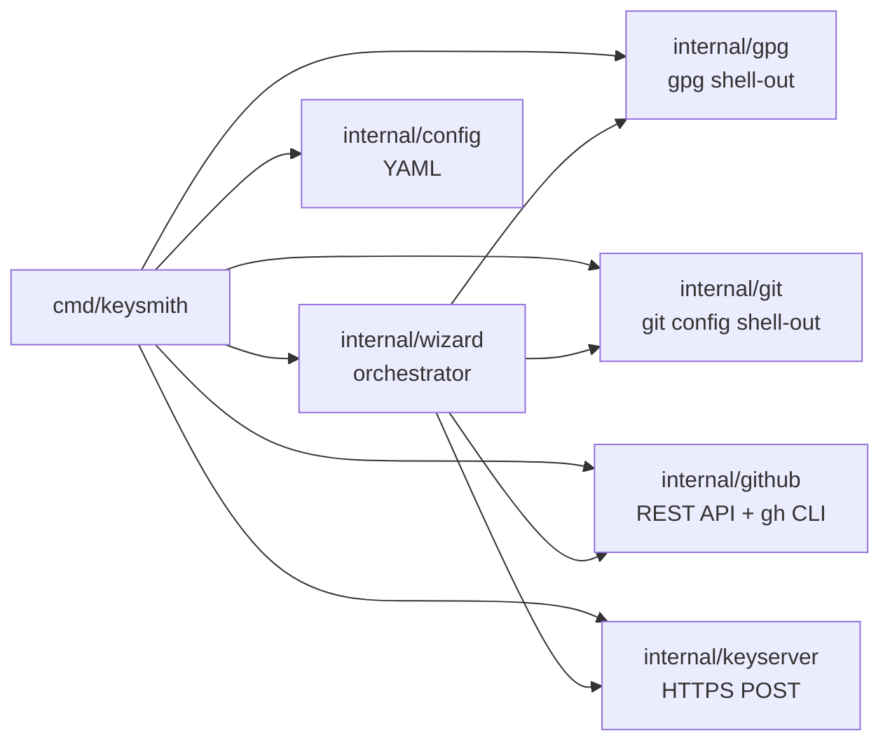

<p align="center">
  
</p>

[](./docs/en/README.md) [](./docs/ru/README.md)
[](./VERSION) [](./LICENSE) [](https://go.dev) [](./docs/en/installation.md)

`gpg-keysmith` walks a developer from "no GPG key" to "signed commits on GitHub" in a single guided flow: generate a key, export it, publish the public key to GitHub and a keyserver, configure `git config user.signingkey`, and upload the private key as a repository secret for CI signing.

- **One command, full setup** — `keysmith wizard` orchestrates detect → generate → export → git-config → github → publish, with resume-on-failure.
- **Safe by design** — passphrase via `--passphrase-fd 0` stdin (never a CLI arg, never a batch file); private key held in memory only (never on disk, never logged, never printed); GitHub PAT read from an env var (never a `--token` flag).
- **Drives battle-tested tools** — shells out to `gpg`, `git`, and `gh` rather than reimplementing crypto. Only validated hex key IDs and owner/repo names ever reach a subprocess.

## Quick start

```bash
go install github.com/Korrnals/gpg-keysmith/cmd/keysmith@latest
export GITHUB_TOKEN=ghp_your_pat_with_repo_admin_gpg_key
keysmith wizard
```

The wizard guides you through every step interactively and resumes from the last completed step if it fails.

## Installation

### From source (recommended for development)

```bash
git clone https://github.com/Korrnals/gpg-keysmith.git
cd gpg-keysmith
make install   # installs to $GOBIN (or $GOPATH/bin)
```

### From a release binary

Download the binary for your platform from [GitHub Releases](https://github.com/Korrnals/gpg-keysmith/releases), verify its SHA-256 checksum, and put it on your `PATH`:

```bash
chmod +x keysmith
sudo mv keysmith /usr/local/bin/
```

### Via `go install`

```bash
go install github.com/Korrnals/gpg-keysmith/cmd/keysmith@latest
```

### Runtime dependencies

| Tool | Why | Required by |
|---|---|---|
| `gpg` (GnuPG 2.x) | Key generation, export, listing | every command |
| `git` | `git config` signing settings | `git-config`, `wizard` |
| `gh` (GitHub CLI) | Repository secret upload (libsodium sealing) | `github`, `wizard`, `status` |

See [Installation](./docs/en/installation.md) for per-OS install instructions, shell completion, and config file location.

## Usage

```bash
keysmith wizard            # full interactive setup (recommended)
keysmith detect            # list existing GPG secret keys
keysmith generate          # generate a new GPG key
keysmith status --repo owner/name   # inspect setup state
```

Every command accepts `--help` for full flag documentation:

```bash
keysmith <command> --help
```

## Documentation

| Topic | Document |
|---|---|
| Installation & prerequisites | [docs/en/installation.md](./docs/en/installation.md) |
| Architecture & package layout | [docs/en/architecture.md](./docs/en/architecture.md) |
| Security model & threat model | [docs/en/security.md](./docs/en/security.md) |
| Command reference | [docs/en/commands/](./docs/en/commands/) |
| Russian translation | [docs/ru/README.md](./docs/ru/README.md) |

## Architecture

`gpg-keysmith` is a Go CLI built on [spf13/cobra](https://github.com/spf13/cobra) and [AlecAivazis/survey](https://github.com/AlecAivazis/survey). It is **not** a Go GPG library binding — it shells out to the system `gpg` binary via `exec.Command` with validated arguments, and to `git` for config. The GitHub integration uses the REST API over `net/http` for public-key upload, file commit, and PR; it shells out to `gh secret set` for repository secrets so libsodium sealing stays in the battle-tested `gh` CLI. Keyserver publish is a plain HTTPS POST.

Full details: [Architecture](./docs/en/architecture.md).



## Security

The three protected assets — **passphrase**, **private key**, and **GitHub PAT** — never cross a leak surface:

- Passphrase: piped to `gpg` via `--passphrase-fd 0` (stdin), never a CLI arg, never written to the batch file.
- Private key: exported into memory only; never written to disk, never logged, never printed. Held in-process for the `github` step and discarded at exit.
- GitHub PAT: read from an env var named by `config.github.token_env` (default `GITHUB_TOKEN`, fallback `GH_TOKEN`). The `--token` flag was removed in security hardening because it leaked via `ps` and `/proc/cmdline`.
- All user-supplied identifiers (key ID, fingerprint, owner/repo) are hex- or charset-validated before reaching any subprocess or URL path.

Full threat model, controls, and non-goals: [Security](./docs/en/security.md).

## Contributing

Pull requests welcome. Before submitting:

```bash
make ci     # mod verify + fmt + vet + build + test — must be green
```

Follow [Conventional Commits](https://www.conventionalcommits.org/) for commit messages. The project uses a 10-milestone roadmap (all milestones complete as of v0.7.0); see [DEVELOPMENT.md](./DEVELOPMENT.md) for the original plan.

## License

MIT — see [LICENSE](./LICENSE). Copyright (c) 2026 Leonid Golikhin.