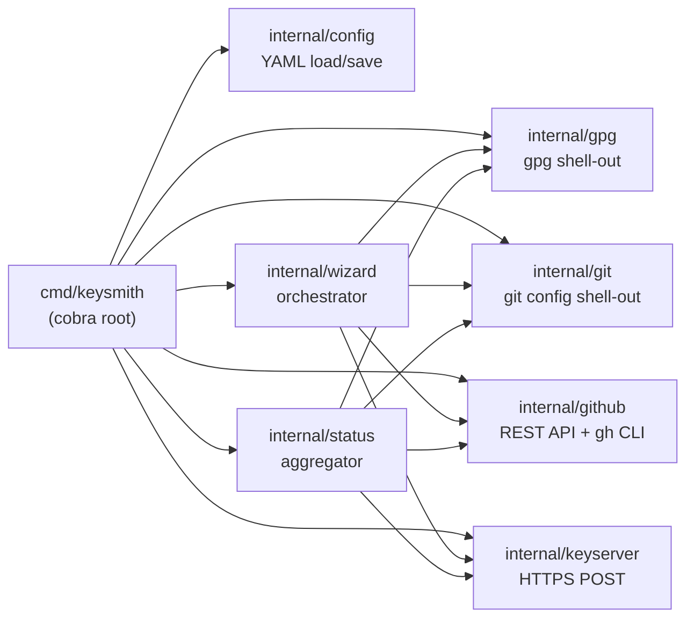

# Architecture

This document describes the package layout, the integration model for `gpg` / `git` / `gh` / keyservers, and the security architecture of `gpg-keysmith`.

## Milestone roadmap

All ten milestones are complete as of v0.7.0. Security hardening (S1–S6) and lint pass were applied on top.

| M | Milestone | Status | What shipped |
|---|---|---|---|
| M1 | Project scaffold | ✅ | cobra CLI root + 8 subcommand stubs, `internal/` package layout, `go.mod`, `Makefile` |
| M2 | `detect` command | ✅ | Parse `gpg --list-secret-keys --with-colons`, render a table; export `DetectKeyForEmail` |
| M3 | `generate` command | ✅ | Drive `gpg --gen-key` with a batch file + `--pinentry-mode loopback` + `--passphrase-fd 0` stdin |
| M4 | `export` command | ✅ | ASCII-armored public key to file; private key in memory only; `ValidateKeyID` hex guard |
| M5 | `git-config` command | ✅ | Set six git config keys; resolve empty name/email/signingkey from existing config or `detect` |
| M6 | `github` command group | ✅ | Public-key upload REST API, repo secrets via `gh`, pubkey file commit + PR |
| M7 | `publish` command | ✅ | HTTPS POST to `keys.openpgp.org` + `keyserver.ubuntu.com` |
| M8 | `wizard` command | ✅ | Orchestrate M2–M7 in order, per-step confirm/retry, resume via `state.json` |
| M9 | `status` command | ✅ | Read-only inspector with ✅ / ❌ / ⚠️ per-step indicators + remediation hints |
| M10 | Config + polish | ✅ | `config.yaml` defaults, `config init` / `show` / `path`, `--config` flag, shell completion |
| S1–S6 | Security hardening | ✅ | Remove `--token` flag, `json:"-"` on wizard secrets, owner/repo + fingerprint validation, config 0600 |

## Package layout

```
cmd/keysmith/main.go        — cobra root + subcommand wiring
internal/
  gpg/        — gpg CLI wrapper (detect, generate, export)
  git/        — git config shell-out
  github/     — GitHub REST API client (pubkey, secrets, repo) + gh CLI secrets
  keyserver/  — keyserver publish client (HTTPS POST)
  config/     — YAML config loader/writer
  wizard/     — orchestration of the full flow
  status/     — read-only setup inspector
```

### Dependency rules

- No `internal/` package imports `cmd/`.
- `internal/wizard` and `internal/status` are aggregators — they may import any other `internal/` package.
- `internal/github` does not import `internal/git` and vice versa.
- `internal/gpg` is the only package allowed to shell out to the `gpg` binary.
- `internal/git` is the only package allowed to shell out to `git`.
- `internal/github` shells out to `gh` for secrets only; everything else uses `net/http`.



## How GPG is integrated

`gpg-keysmith` is **not** a Go GPG library binding. It shells out to the system `gpg` binary via `exec.Command`. The `gpg` binary is a runtime dependency that must be installed on the system.

### Why shell out instead of using a Go binding

- `gpg` (GnuPG) is battle-tested, audited, and the reference OpenPGP implementation. Reimplementing key generation or export in Go would re-introduce crypto bugs that GnuPG has already fixed.
- Go-native OpenPGP libraries (e.g. `golang.org/x/crypto/openpgp`) are immature for key generation and do not match GnuPG's feature surface.
- Shelling out with **validated arguments** is safe: key IDs are hex-validated (no shell metacharacters can reach `exec.Command`), and `exec.Command` does not invoke a shell, so there is no shell-injection vector.

### The four `gpg` invocations

All four live in `internal/gpg`. Only this package calls `gpg`.

| Operation | gpg invocation | Used by | Secret handling |
|---|---|---|---|
| List keys | `gpg --list-secret-keys --keyid-format=long --with-colons` | `detect`, `git-config`, `wizard`, `status` | No passphrase needed |
| Generate key | `gpg --gen-key --batch --pinentry-mode loopback --passphrase-fd 0` (batch file on disk, passphrase via stdin) | `generate`, `wizard` | Passphrase piped via stdin, never in batch file |
| Export public key | `gpg --armor --export <keyID>` | `export`, `github`, `publish`, `wizard` | No passphrase needed |
| Export private key | `gpg --armor --export-secret-keys --pinentry-mode loopback --passphrase-fd 0 <keyID>` | `export`, `wizard` (held in memory) | Passphrase piped via stdin; output captured in memory, never written to disk |

### Batch file for `generate`

`gpg --gen-key` reads a parameter file with key metadata (algorithm, length, name, email, expiry). The `%no-protection` directive is deliberately **absent** — `gpg-keysmith` always requires a passphrase. The passphrase is piped to `gpg` via `--passphrase-fd 0` (stdin) with `--pinentry-mode loopback`; it never appears in the batch file, never appears in the process args, and is never logged.

## How git is integrated

`internal/git` shells out to `git config` (not [go-git](https://github.com/go-git/go-git)). This keeps the dependency surface small and matches the behaviour a user would get from running `git config` themselves.

`git-config` sets six keys:

| Config key | Value |
|---|---|
| `user.name` | real name for the commit author |
| `user.email` | email for the commit author |
| `user.signingkey` | the GPG key id to sign with |
| `commit.gpgsign` | `true` (sign every commit) |
| `gpg.format` | `openpgp` (this tool only supports OpenPGP) |
| `tag.gpgsign` | `true` (sign every tag) |

By default these go into the local repo config; `--global` writes to the global user config instead.

## How GitHub is integrated

`internal/github` uses two integration channels:

| Channel | What | Why |
|---|---|---|
| `net/http` REST API | Public-key upload (`users/gpg_keys`), repo file commit, PR open | Direct, no extra binary needed; REST calls are easy to validate |
| `gh` CLI shell-out | Repo Action secrets (`GPG_PRIVATE_KEY`, `GPG_PASSPHRASE`) | `gh secret set` handles libsodium sealed-secret encryption natively; reimplementing it in Go would pull in a libsodium native binding |

### Token resolution

The PAT is resolved from env vars only, never a flag:

1. `config.github.token_env` (default `GITHUB_TOKEN`)
2. `GH_TOKEN` (fallback)

The `--token` flag was removed in security hardening (S1) because it leaked via `ps` and `/proc/cmdline`.

### Required PAT scopes

| Scope | Why |
|---|---|
| `admin:gpg_key` | Upload the public key to the user's GitHub GPG keys |
| `repo` | Set repo secrets, commit the pubkey file, open a PR |
| `admin:repo_hook` | Required alongside `repo` for repo-secret writes |

## How keyserver is integrated

`internal/keyserver` publishes via plain HTTPS POST — not the legacy HKP `hkp://` protocol.

| Keyserver | Endpoint | Used by default |
|---|---|---|
| `keys.openpgp.org` | `https://keys.openpgp.org/vks/v1/upload` | yes (preferred) |
| `keyserver.ubuntu.com` | `https://keyserver.ubuntu.com/pks/submit` | yes (fallback) |

Use `--keyserver=openpgp` or `--keyserver=ubuntu` to publish to only one. On success, `publish` prints the verification URL for each keyserver:

```
https://keys.openpgp.org/vks/vby/<fingerprint>
```

The fingerprint is hex-validated before being interpolated into the URL path.

## Security architecture

The three protected assets and the controls that keep them off every leak surface:

| Asset | Leak surfaces avoided | Control |
|---|---|---|
| Passphrase | CLI args (`ps`, `/proc/cmdline`), batch file, logs | Piped to `gpg` via `--passphrase-fd 0` stdin; collected via a masked `survey.Password` field |
| Private key | Disk, logs, stdout | Exported into memory only; `json:"-"` tag on `WizardState.PrivateKey`; held in-process for the `github` step, discarded at exit |
| GitHub PAT | CLI args, config file | Read from an env var named by `config.github.token_env`; `--token` flag removed; config stores only the env var name, never the value |

Validation boundaries on all user-supplied identifiers before they reach a subprocess or URL path:

- **Key ID** — `ValidateKeyID` rejects non-hex characters and lengths over 40 chars (anti-injection into `gpg` argv).
- **Fingerprint** — hex-validated before interpolation into `https://keys.openpgp.org/vks/vby/<fingerprint>`.
- **owner/repo** — `ValidateOwnerRepo` rejects anything outside `^[A-Za-z0-9._-]+$`; `url.PathEscape` applied as defense-in-depth.

Full threat model and controls: [Security](./security.md).

## Config file

The config at `~/.config/gpg-keysmith/config.yaml` (XDG-aware) holds persistent defaults. It is written mode `0600` and never stores the PAT value — only the env var name holding it.

```yaml
key:
  type: RSA
  length: 4096
  expire: "0"
github:
  token_env: GITHUB_TOKEN
  repo: ""
keyserver:
  preferred: keys.openpgp.org
  fallback: keyserver.ubuntu.com
```

Subcommands that read config (`generate`, `publish`, `github`, `status`, `wizard`) use its values as defaults; explicit flags always override config values.

See [`config` command](./commands/config.md) for `init` / `show` / `path`.