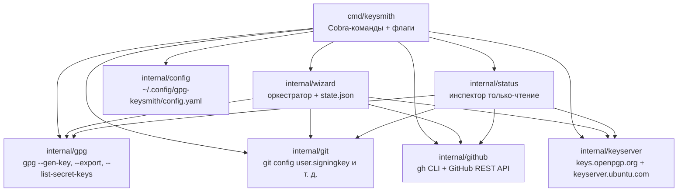

# Контрибьюция в gpg-keysmith

`gpg-keysmith` — это Go-CLI, который автоматизирует весь путь от «нет GPG-ключа» до «подписанные коммиты идут на GitHub»: генерацию ключа, экспорт, настройку подписи в git, загрузку публичного ключа на GitHub, сохранение приватного ключа и парольной фразы как секретов репозитория, и публикацию публичного ключа на ключевой сервер — всё это оркестрируется одной командой `keysmith wizard`. Контрибьюции приветствуются: баг-репорты, фиксы, улучшения документации, новые возможности.

## Предварительные требования

| Инструмент | Версия | Зачем |
| --- | --- | --- |
| Go | 1.22+ | Сборка и тестирование CLI |
| `gpg` | любой современный GnuPG | Время выполнения: генерация/экспорт/обнаружение ключей |
| `git` | любой современный git | Время выполнения: настройка подписи и операции с репозиторием |
| `gh` | GitHub CLI 2.0+ | Время выполнения: шаг `github` (секреты репозитория + PR) |
| `golangci-lint` | последняя | Линт-гейт CI (`make ci`, шаг 3) |
| `upx` | любая недавняя | Опционально — UPX-сжатие релизных артефактов |

Установите инструменты времени выполнения через пакетный менеджер ОС (`apt`, `brew` и т. д.). `golangci-lint` и `upx` опциональны для обычной разработки — `make ci` корректно деградирует при их отсутствии, а `make build` пропускает UPX, если `upx` не установлен или целевая ОС — macOS.

## Получение исходников

```bash
git clone https://github.com/Korrnals/gpg-keysmith.git
cd gpg-keysmith
make build    # компилирует keysmith в ./bin (UPX-сжат, если upx есть)
make ci       # 7-шаговый локальный CI-гейт — должен быть зелёным перед PR
```

Сборка создаёт `./bin/keysmith`. Запускайте напрямую или добавьте `./bin` в `PATH` для локального тестирования.

## Процесс разработки

Проект использует **trunk-based**-подход: короткоживущие feature-ветки от `main`, мердж через squash-merge pull request.

1. **Ветка.** Создайте ветку от `main` с описательным kebab-case-именем и префиксом типа:

   ```bash
   git checkout main
   git pull
   git checkout -b feat/support-ed25519   # новая возможность
   git checkout -b fix/publish-retry      # багфикс
   git checkout -b docs/man-page          # только документация
   ```

2. **Коммит.** Используйте [Conventional Commits](https://www.conventionalcommits.org/) для сообщений коммитов. Scope — затронутый пакет или команда:

   ```text
   feat(gpg): support ed25519 key generation
   fix(publish): retry on transient HTTP 503
   docs(commands): document --passphrase-file behaviour
   refactor(wizard): extract step runner for testability
   test(github): cover repo-secrets happy path
   chore: bump go version to 1.22
   ```

   Группируйте коммиты по **логической теме**, а не по сессии или файлу. Сессия с фиксом + багфиксом + полировкой документации становится тремя коммитами, а не одним. Каждый коммит — одна связная тема, которую ревьюер может рассмотреть изолированно.

3. **Push и PR.** Отправьте ветку, откройте pull request на GitHub, запросите ревью. Сошлитесь на issue, которое закрывает PR, в теле (например, `Closes #42`).

4. **Squash-merge.** Поддерживаемая история — один коммит на мердж. Прямых коммитов в `main` нет; каждое изменение проходит через ревью.

## Локальный CI

`make ci` запускает 7-шаговый гейт, который зеркалирует то, что мейнтейнер проверяет перед мерджем. Все шаги должны быть зелёными **исправлением, а не подавлением**:

| Шаг | Что делает |
| --- | --- |
| 1 | `go mod verify` — зависимости совпадают с `go.sum` |
| 2 | `gofmt -l` — все Go-файлы отформатированы (область: git-tracked `*.go`) |
| 3 | `golangci-lint run ./...` — 0 issues обязательно |
| 4 | `go vet ./...` — статический анализ |
| 5 | `go build ./...` — весь модуль компилируется |
| 6 | `go test -race ./...` — юнит-тесты с race-детектором |
| 7 | `go vet` по `integration` build-tag — tagged-тесты компилируются |

**Pre-commit hook** запускает `make ci` автоматически на каждом коммите. Установите его один раз через `scripts/install-hooks.sh` (хук-файл gitignored — живёт в `.git/hooks/` и не коммитится):

```bash
scripts/install-hooks.sh
```

### Дисциплина линта

`golangci-lint` должен показывать **0 issues**. Когда срабатывает находка:

1. Прочитайте сообщение и поймите, какое правило сработало.
2. Исправьте корневую причину, чтобы сообщение исчезло **потому что проблема устранена**, а не потому что сигнал заглушен.
3. Подавление (`//nolint:...`) допустимо **только** для подтверждённого false-positive самого линтера (не вашего кода), с однострочным комментарием с правилом и причиной, в рамках одной строки или функции. Косметическое недовольство правилом — не основание.

Это соответствует проектной политике lint-and-validate: зелёный прогон, полученный подавлением, не является зелёным прогоном.

## Тестирование

```bash
go test -race ./...                    # все юнит-тесты, race-детектор включён
go test -race ./internal/wizard/...    # один пакет
go test -tags=integration ./...        # только интеграционные (нужны реальные gpg/git/gh)
```

### Конвенции юнит-тестов

Юнит-тесты должны быть **детерминированными и изолированными**:

- **Без реальных subprocess.** Замокайте границы (gpg, git, gh, keyserver) через переопределение function-variable. См. `internal/wizard/wizard_test.go` (таблица `stepRunners`) и `cmd/keysmith/main_test.go` (вспомогательные `*Fn` package-переменные, например `detectExistingKeysFn`) — установившийся паттерн.
- **Без реальной сети.** Используйте `net/http/httptest` для HTTP-пакетов (`internal/github`, `internal/keyserver`). См. `internal/keyserver/publish_test.go`.
- **Временные директории, не фиксированные пути.** Используйте `t.TempDir()` для любых файловых записей; никогда не пишите в реальные `~/.gnupg` или `~/.config`.
- **Очистка состояния.** В `cmd/keysmith/main_test.go` `resetGlobalFlags(t)` регистрируется через `t.Cleanup`, чтобы один тест не утекал package-level flag-состояние в следующий. Следуйте тому же паттерну, затрагивая глобальные флаги.

Интеграционные тесты помечены `//go:build integration` и исключены из обычного `go test ./...`. Они запускают реальные `gpg`/`git`/`gh` бинарники и предназначены для локальной проверки мейнтейнера, а не CI.

## Релизы

Только **мейнтейнер** нарезает релизы. Контрибьюторам это не нужно.

Процесс релиза — в `scripts/release.sh`: бампит `VERSION` (единый источник истины), обновляет `CHANGELOG.md`, собирает UPX-сжатые артефакты, коммитит, тегает, отправляет и создаёт GitHub Release с артефактами:

```bash
scripts/release.sh patch      # 1.1.1 -> 1.1.2
scripts/release.sh minor      # 1.1.1 -> 1.2.0
scripts/release.sh major      # 1.1.1 -> 2.0.0
scripts/release.sh --no-upload  # бамп локально без отправки релиза
```

Скрипт гейтится на `scripts/ci.sh` (те же 7 шагов, что `make ci`) — красный CI блокирует релиз. `CHANGELOG.md` следует формату [Keep a Changelog](https://keepachangelog.com/en/1.1.0/); каждый релиз переводит секцию `## [Unreleased]` в датированную `## [x.y.z] — YYYY-MM-DD`.

## Архитектура

gpg-keysmith — слоистый CLI. Пакет `cmd/keysmith` связывает команды Cobra с пакетами `internal/*`, каждый из которых владеет одной ответственностью:



Ключевые правила:

- `internal/gpg` — **единственный** пакет, который вызывает бинарник `gpg`. Любой другой пакет, которому нужен ключевой материал, обращается в него — нигде больше нет прямых `exec.Command("gpg", ...)`.
- `internal/git` и `internal/github` **полностью развязаны** — ни один не импортирует другой. Они не делят ничего, кроме локально определённых типов.
- `internal/wizard` и `internal/status` — **агрегаторы**: вызывают листовые пакеты (`gpg`, `git`, `github`, `keyserver`), но сами не владеют subprocess-вызовами.

Полное обоснование дизайна, границы модулей и narrative потока данных: [architecture](../../docs/en/architecture.md).

## Безопасность

Три защищённых актива никогда не пересекают поверхность утечки: **парольная фраза**, **приватный ключ**, **GitHub PAT**.

- **Парольная фраза** передаётся в `gpg` через `--passphrase-fd 0` (stdin). Она никогда не появляется в CLI-аргументе, batch-файле, логе или файле состояния wizard. Флага `--passphrase` нет — он бы утёк через `ps` и `/proc/<pid>/cmdline`. Неинтерактивный CI использует `--passphrase-file <path>` (file-perms предупреждает, если слабее `0600`).
- **Приватный ключ** экспортируется только в память — никогда на диск, в лог или stdout. Хранится в процессе для шага `github` (загружается как секрет репозитория) и сбрасывается при выходе.
- **GitHub PAT** читается из env-переменной, указанной в `config.github.token_env` (по умолчанию `GITHUB_TOKEN`, фоллбэк `GH_TOKEN`). Флаг `--token` удалён при security-hardening — утёк через `ps` и `/proc/cmdline`.

Полная модель угроз, контроли и non-goals: [security](../en/security.md).

Внося изменение, затрагивающее любой из этих активов, сначала прочитайте security-док и убедитесь, что изменение сохраняет инварианты выше.

## Репортинг issues

Откройте [GitHub issue](https://github.com/Korrnals/gpg-keysmith/issues) для баг-репортов и запросов возможностей. Включите:

- версию `keysmith` (`keysmith --version` или `cat VERSION`);
- ОС и версию Go (`go version`);
- точную команду и полный вывод ошибки;
- шаги воспроизведения.

Для **security-проблем** не открывайте публичный issue. См. раздел [reporting security issues](../en/security.md#reporting-security-issues) для процесса ответственного раскрытия.

## Кодекс поведения

Будьте уважительны. Предполагайте добрые намерения. Не соглашайтесь по техническим достоинствам, а не по личности. Pull request — не одолжение, которое вам должны, а ревью — не атака на вас; и то, и другое — то, как проект становится лучше. Сохраняйте профессиональный тон, ссылайтесь на конкретики и оставляйте кодовую базу чище, чем нашли.