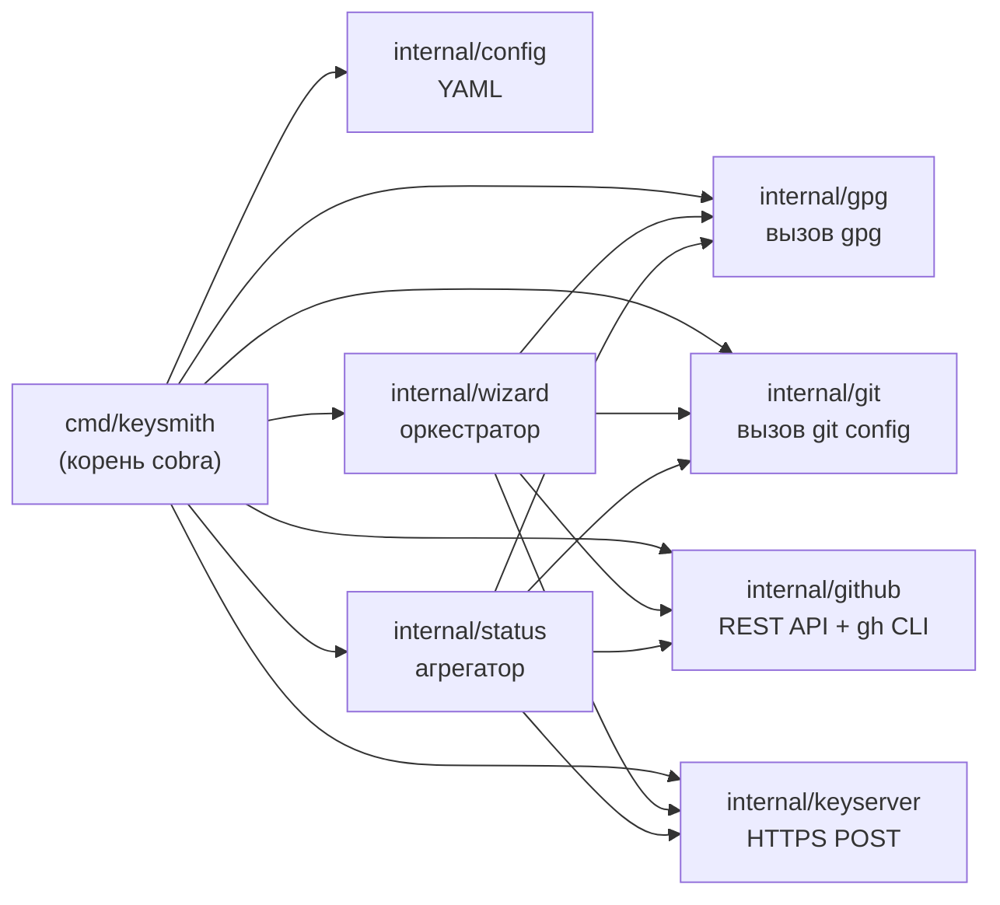

# Архитектура

Этот документ описывает структуру пакетов, модель интеграции с `gpg` / `git` / `gh` / серверами ключей и архитектуру безопасности `gpg-keysmith`.

## Дорожная карта этапов

Все десять этапов выполнены по состоянию на v0.7.0. Поверх них применены работы по усилению безопасности (S1–S6) и проход линтера.

| M | Этап | Статус | Что доставлено |
|---|---|---|---|
| M1 | Каркас проекта | ✅ | корень cobra + заглушки 8 подкоманд, структура `internal/`, `go.mod`, `Makefile` |
| M2 | Команда `detect` | ✅ | Разбор `gpg --list-secret-keys --with-colons`, таблица; экспорт `DetectKeyForEmail` |
| M3 | Команда `generate` | ✅ | Вызов `gpg --gen-key` с batch-файлом + `--pinentry-mode loopback` + `--passphrase-fd 0` stdin |
| M4 | Команда `export` | ✅ | ASCII-armored публичный ключ в файл; приватный ключ в памяти; `ValidateKeyID` (hex-проверка) |
| M5 | Команда `git-config` | ✅ | Устанавливает шесть ключей git config; пустые name/email/signingkey берутся из существующей конфигурации или `detect` |
| M6 | Группа команд `github` | ✅ | Загрузка публичного ключа через REST API, секреты репозитория через `gh`, коммит файла ключа + PR |
| M7 | Команда `publish` | ✅ | HTTPS POST на `keys.openpgp.org` + `keyserver.ubuntu.com` |
| M8 | Команда `wizard` | ✅ | Оркестрация M2–M7 по порядку, подтверждение на шаге, возобновление через `state.json` |
| M9 | Команда `status` | ✅ | Инспектор только для чтения с поэтапными индикаторами ✅ / ❌ / ⚠️ и подсказками по исправлению |
| M10 | Конфигурация и полировка | ✅ | `config.yaml` с значениями по умолчанию, `config init` / `show` / `path`, флаг `--config`, автодополнение |
| S1–S6 | Усиление безопасности | ✅ | Удалён флаг `--token`, `json:"-"` на секретных полях wizard, валидация owner/repo + fingerprint, конфиг 0600 |

## Структура пакетов

```
cmd/keysmith/main.go        — корень cobra + связывание подкоманд
internal/
  gpg/        — обёртка над gpg (detect, generate, export)
  git/        — вызов git config
  github/     — клиент REST API GitHub (pubkey, secrets, repo) + секреты через gh
  keyserver/  — клиент публикации на сервер ключей (HTTPS POST)
  config/     — загрузка/запись YAML-конфига
  wizard/     — оркестрация полного потока
  status/     — инспектор состояния настройки
```

### Правила зависимостей

- Ни один пакет в `internal/` не импортирует `cmd/`.
- `internal/wizard` и `internal/status` — агрегаторы; могут импортировать любые другие пакеты `internal/`.
- `internal/github` не импортирует `internal/git` и наоборот.
- Только `internal/gpg` имеет право вызывать `gpg`.
- Только `internal/git` имеет право вызывать `git`.
- `internal/github` вызывает `gh` только для секретов; всё остальное — через `net/http`.



## Как интегрирован GPG

`gpg-keysmith` — **не** библиотечная Go-привязка к GPG. Он вызывает системный `gpg` через `exec.Command`. `gpg` — обязательная runtime-зависимость, которая должна быть установлена в системе.

### Почему вызов внешнего процесса, а не Go-привязка

- `gpg` (GnuPG) — проверенная, прошедшая аудит эталонная реализация OpenPGP. Переизобретение генерации ключа или экспорта на Go вернёт криптографические баги, которые GnuPG уже исправил.
- Родные Go-библиотеки OpenPGP (например, `golang.org/x/crypto/openpgp`) недостаточно зрелы для генерации ключа и не покрывают функциональность GnuPG.
- Вызов внешнего процесса с **провалидированными аргументами** безопасен: key ID проверяются на hex (ни один shell-метасимвол не попадёт в `exec.Command`), а `exec.Command` не вызывает shell, поэтому shell-инъекция невозможна.

### Четыре вызова `gpg`

Все четыре живут в `internal/gpg`. Только этот пакет вызывает `gpg`.

| Операция | Вызов gpg | Используется в | Обработка секрета |
|---|---|---|---|
| Листинг ключей | `gpg --list-secret-keys --keyid-format=long --with-colons` | `detect`, `git-config`, `wizard`, `status` | Парольная фраза не нужна |
| Генерация ключа | `gpg --gen-key --batch --pinentry-mode loopback --passphrase-fd 0` (batch-файл на диске, парольная фраза через stdin) | `generate`, `wizard` | Парольная фраза подаётся через stdin, в batch-файле её нет |
| Экспорт публичного ключа | `gpg --armor --export <keyID>` | `export`, `github`, `publish`, `wizard` | Парольная фраза не нужна |
| Экспорт приватного ключа | `gpg --armor --export-secret-keys --pinentry-mode loopback --passphrase-fd 0 <keyID>` | `export`, `wizard` (хранится в памяти) | Парольная фраза через stdin; вывод перехватывается в память, на диск не пишется |

### Batch-файл для `generate`

`gpg --gen-key` читает файл параметров с метаданными ключа (алгоритм, длина, имя, email, срок). Директива `%no-protection` намеренно **отсутствует** — `gpg-keysmith` всегда требует парольную фразу. Парольная фраза подаётся в `gpg` через `--passphrase-fd 0` (stdin) с `--pinentry-mode loopback`; она никогда не попадает в batch-файл, не появляется в аргументах процесса и не записывается в лог.

## Как интегрирован git

`internal/git` вызывает `git config` (не [go-git](https://github.com/go-git/go-git)). Это сохраняет зависимостную поверхность маленькой и повторяет поведение, которое пользователь получил бы, выполнив `git config` вручную.

`git-config` устанавливает шесть ключей:

| Ключ конфига | Значение |
|---|---|
| `user.name` | настоящее имя для автора коммита |
| `user.email` | email для автора коммита |
| `user.signingkey` | GPG key id для подписи |
| `commit.gpgsign` | `true` (подписывать каждый коммит) |
| `gpg.format` | `openpgp` (только OpenPGP поддерживается) |
| `tag.gpgsign` | `true` (подписывать каждый тег) |

По умолчанию значения пишутся в локальную конфигурацию репозитория; флаг `--global` переключает на глобальную пользовательскую конфигурацию.

## Как интегрирован GitHub

`internal/github` использует два канала интеграции:

| Канал | Что | Зачем |
|---|---|---|
| REST API через `net/http` | Загрузка публичного ключа (`users/gpg_keys`), коммит файла в репозиторий, открытие PR | Прямой вызов, без дополнительного бинарника; REST-вызовы легко валидируются |
| Вызов `gh` CLI | Секреты Actions репозитория (`GPG_PRIVATE_KEY`, `GPG_PASSPHRASE`) | `gh secret set` нативно шифрует секреты libsodium; переизобретать это на Go означало бы тянуть нативную привязку libsodium |

### Разрешение токена

PAT берётся только из переменных окружения, никогда из флага:

1. `config.github.token_env` (по умолчанию `GITHUB_TOKEN`)
2. `GH_TOKEN` (запасной вариант)

Флаг `--token` **удалён** при усилении безопасности (S1), потому что его значение утекало через `ps` и `/proc/cmdline`.

### Требуемые scope'ы PAT

| Scope | Зачем |
|---|---|
| `admin:gpg_key` | Загрузить публичный ключ в GPG keys пользователя |
| `repo` | Выставить секреты репозитория, закоммитить файл ключа, открыть PR |
| `admin:repo_hook` | Требуется вместе с `repo` для записи секретов репозитория |

## Как интегрирован сервер ключей

`internal/keyserver` публикует через обычный HTTPS POST — не через устаревший протокол HKP `hkp://`.

| Сервер ключей | Endpoint | По умолчанию |
|---|---|---|
| `keys.openpgp.org` | `https://keys.openpgp.org/vks/v1/upload` | да (предпочитаемый) |
| `keyserver.ubuntu.com` | `https://keyserver.ubuntu.com/pks/submit` | да (запасной) |

Используйте `--keyserver=openpgp` или `--keyserver=ubuntu`, чтобы опубликовать только на одном. При успехе `publish` выводит URL проверки для каждого сервера:

```
https://keys.openpgp.org/vks/vby/<fingerprint>
```

Fingerprint проверяется на hex перед интерполяцией в URL.

## Архитектура безопасности

Три защищаемых актива и средства контроля, которые не дают им пересечь поверхность утечки:

| Актив | Избежанные поверхности утечки | Средство контроля |
|---|---|---|
| Парольная фраза | Аргументы CLI (`ps`, `/proc/cmdline`), batch-файл, логи | Подается в `gpg` через `--passphrase-fd 0` stdin; собирается через маскированное поле `survey.Password` |
| Приватный ключ | Диск, логи, stdout | Экспортируется только в память; тег `json:"-"` на `WizardState.PrivateKey`; хранится в процессе для шага `github`, уничтожается при выходе |
| GitHub PAT | Аргументы CLI, файл конфига | Читается из переменной окружения, имя которой задано в `config.github.token_env`; флаг `--token` удалён; конфиг хранит только имя переменной, не значение |

Границы валидации на всех пользовательских идентификаторах до того, как они попадут в подпроцесс или URL:

- **Key ID** — `ValidateKeyID` отвергает не-hex символы и длину больше 40 символов (защита от инъекции в argv `gpg`).
- **Fingerprint** — hex-проверка перед интерполяцией в `https://keys.openpgp.org/vks/vby/<fingerprint>`.
- **owner/repo** — `ValidateOwnerRepo` отвергает всё вне `^[A-Za-z0-9._-]+$`; `url.PathEscape` применяется как дополнительная мера.

Полная модель угроз и средства контроля: [Безопасность](./security.md).

## Файл конфигурации

Конфиг в `~/.config/gpg-keysmith/config.yaml` (с учётом XDG) хранит постоянные значения по умолчанию. Записывается в режиме `0600` и никогда не хранит значение PAT — только имя переменной окружения, в которой оно лежит.

```yaml
key:
  type: RSA
  length: 4096
  expire: "0"
github:
  token_env: GITHUB_TOKEN
  repo: ""
keyserver:
  preferred: keys.openpgp.org
  fallback: keyserver.ubuntu.com
```

Подкоманды, читающие конфиг (`generate`, `publish`, `github`, `status`, `wizard`), используют его значения как значения по умолчанию; явные флаги всегда перекрывают конфиг.

См. справочник команды [`config`](./commands/config.md) для `init` / `show` / `path`.